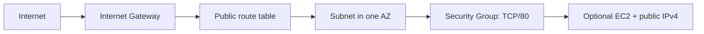

# AWS lab - VPC + EC2 tùy chọn

Lab này chuyển các khái niệm OCI VCN/Subnet/NSG/Compute sang AWS VPC/AZ Subnet/Security Group/EC2.

Mặc định `create_compute = false`, chỉ tạo VPC, Internet Gateway, một public route table, subnet và Security Group. Bật compute mới tạo EC2, EBS và public IPv4.

## Mô hình



So với OCI:

| OCI | AWS trong lab | Lưu ý |
|---|---|---|
| VCN | VPC | Đều regional. |
| Regional subnet | Subnet | AWS subnet luôn thuộc đúng một AZ. |
| Internet Gateway | Internet Gateway | Gần tương đương, nhưng public IP/route vẫn phải đúng. |
| NSG | Security Group | Stateful, gắn ENI/instance; SG không phải subnet NACL. |
| Compute shape | EC2 instance type | Không quy đổi OCPU/vCPU 1:1; benchmark. |
| Platform Image | AMI từ SSM public parameter | Production nên dùng approved/pinned image pipeline. |

## Chi phí và an toàn

- Network-only trong lab không tạo NAT Gateway, Load Balancer hoặc Elastic IP. Các VPC component cơ bản này thường không có hourly charge, nhưng hãy kiểm tra [AWS VPC pricing](https://aws.amazon.com/vpc/pricing/) hiện tại.
- `create_compute = true` tạo EC2, 8 GiB gp3 EBS và một public IPv4; **có thể phát sinh phí** kể cả khi tài khoản có free tier/credit.
- Security Group chỉ mở TCP/80, không mở SSH. Đây vẫn là public demo endpoint; production phải dùng private subnet/LB/WAF/TLS theo threat model.
- Chạy `terraform destroy` và kiểm tra console/bill sau lab. State chỉ quản resource nó biết; đừng coi destroy là kiểm tra billing duy nhất.

## Điều kiện

- Terraform CLI `1.16.x`.
- AWS CLI đã cấu hình SSO/profile hoặc một credential chain ngắn hạn.
- Quyền tối thiểu phù hợp để đọc AZ/SSM parameter và quản VPC, route, SG; thêm EC2 khi bật compute.
- Service quota/capacity cho instance type ở region đã chọn.

## 1. Xác thực local bằng AWS SSO/profile

PowerShell:

```powershell
aws configure sso --profile terraform-lab
aws sso login --profile terraform-lab
$env:AWS_PROFILE = "terraform-lab"
aws sts get-caller-identity
```

Không đặt `AWS_SECRET_ACCESS_KEY` hoặc secret trong `.tf`/`.tfvars`. Trong CI, dùng OIDC/Web Identity để assume role thay vì access key dài hạn.

## 2. Chạy network-only

```powershell
Copy-Item terraform.tfvars.example terraform.tfvars
terraform fmt -check
terraform init
terraform validate
terraform plan -out=network.tfplan
terraform show network.tfplan
terraform apply network.tfplan
terraform output
```

Review plan phải cho thấy **không có** `aws_instance` khi `create_compute = false`.

## 3. Bật EC2 có chủ đích

Sửa `terraform.tfvars`:

```hcl
create_compute = true
```

Sau đó:

```powershell
terraform plan -out=compute.tfplan
terraform show compute.tfplan
terraform apply compute.tfplan
terraform output -raw public_url
```

EC2 cài nginx qua user data; chờ 1-3 phút nếu URL chưa trả kết quả. Sample không tạo SSH key/port 22 để giảm bề mặt tấn công.

## 4. Cleanup bắt buộc

```powershell
terraform plan -destroy -out=destroy.tfplan
terraform show destroy.tfplan
terraform apply destroy.tfplan
```

Sau đó kiểm tra EC2, Volumes, Public IPv4 và VPC ở **đúng region**. Xóa local plan/state chỉ sau khi chắc chắn resource đã destroy; local state có thể cần cho điều tra.

## Remote state cho team

`backend.s3.tf.example` minh họa S3 backend. Bootstrap bucket/state riêng, bật versioning, encryption, public-access block và object-prefix IAM, rồi đổi template thành `backend.tf` và chạy:

```powershell
terraform init -migrate-state
```

`use_lockfile = true` bật S3 native locking. DynamoDB-based locking đã deprecated trong tài liệu Terraform hiện hành. Backend credential và AWS provider credential có thể cần permission khác nhau.

## Các bài mở rộng

1. Tạo private subnet ở AZ thứ hai và NAT/egress design sau khi đã đọc pricing.
2. Thay public EC2 bằng ALB + private Auto Scaling Group; bật HTTPS và health check.
3. Dùng VPC endpoints cho SSM/S3, bỏ public IPv4 và truy cập qua Systems Manager.
4. Tách network/app thành hai state; publish subnet IDs bằng contract nhỏ.
5. Thêm VPC Flow Logs, CloudWatch alarm, AWS Config rule và budget.

Nguồn: [AWS provider](https://registry.terraform.io/providers/hashicorp/aws/latest/docs), [Terraform AWS tutorial](https://developer.hashicorp.com/terraform/tutorials/aws-get-started/aws-create), [AWS AZ IDs](https://docs.aws.amazon.com/global-infrastructure/latest/regions/az-ids.html), [S3 backend](https://developer.hashicorp.com/terraform/language/backend/s3).
