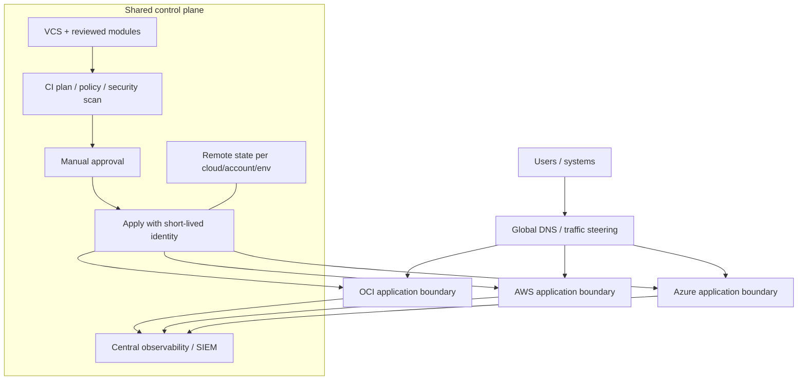
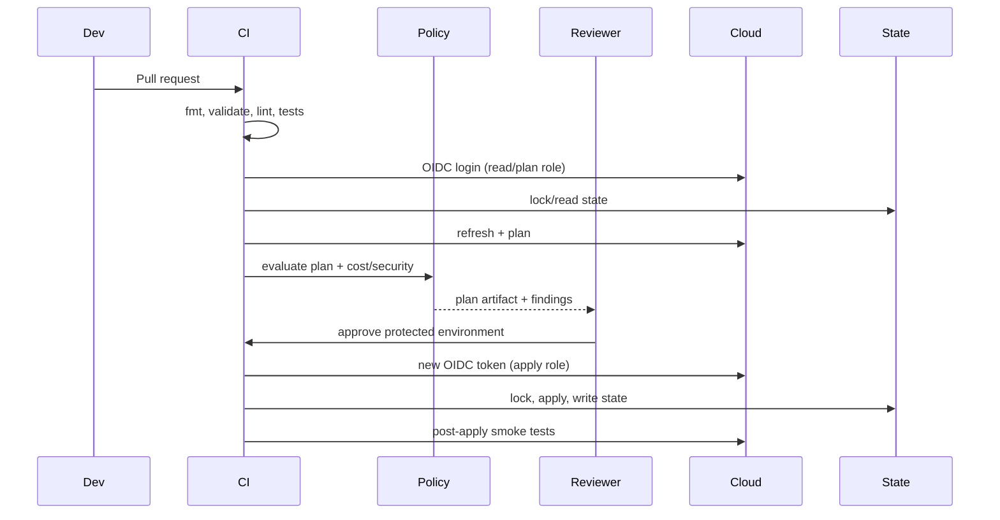

# 03 - Thiết kế Terraform multi-cloud trong dự án thật

## 1. Chọn lý do trước khi chọn kiến trúc

| Mục tiêu | Pattern phù hợp | Cái giá phải trả |
|---|---|---|
| Mua dịch vụ tốt nhất từng cloud | Best-of-breed, mỗi workload có một primary cloud | Identity/network/observability phân mảnh; egress giữa cloud |
| Giảm rủi ro outage nhà cung cấp | Active/passive hoặc pilot light ở cloud thứ hai | Data replication, DNS failover, test DR và capacity reservation |
| Tránh lock-in cho workload quan trọng | Portable runtime + abstraction ở interface | Không tận dụng hết managed service đặc thù; “lowest common denominator” |
| M&A hoặc nhiều business unit | Federated landing zones + shared governance | Chuẩn hóa chậm, policy/ownership phức tạp |
| Tuân thủ/data residency | Chọn region/cloud theo data classification | Data flow, key ownership, audit và vendor constraints |
| Chỉ để “có multi-cloud” | Không nên triển khai | Chi phí/complexity tăng nhưng không có business outcome đo được |

Multi-cloud không đồng nghĩa mọi ứng dụng chạy active/active trên cả ba cloud. Thiết kế đơn giản nhất đáp ứng RTO/RPO thường đáng tin cậy nhất.

## 2. Kiến trúc tham chiếu



Các boundary quan trọng:

- **Control plane chung** có thể chuẩn hóa review, policy, artifact và audit.
- **Execution identity riêng** cho từng cloud/account/subscription/compartment; không dùng một super-admin key.
- **State riêng** theo blast radius; không gom tất cả cloud vào một state lớn.
- **Data plane** chỉ kết nối khi có requirement và threat model rõ ràng.

## 3. Cái gì chuẩn hóa, cái gì giữ cloud-native?

| Lớp | Nên chuẩn hóa | Nên để cloud-specific |
|---|---|---|
| Module interface | `environment`, `workload`, CIDR, tags, SLO class, data classification | Tên resource type, SKU/shape, zone rules, provider features |
| Identity | Workload identity, credential ngắn hạn, least privilege, break-glass process | OCI dynamic group/policy; AWS role/policy; Azure managed identity/RBAC |
| Network | IPAM, segmentation intent, port/protocol contract, DNS naming | IGW/DRG/TGW/vWAN, route propagation, NSG/NACL semantics |
| Compute | Image hardening, patch SLO, immutable deployment, health contract | Shape/instance type/VM size, metadata, autoscaling implementation |
| Data | Classification, encryption, backup policy, RTO/RPO, retention | Database engine/offering, replication API, consistency model |
| Observability | OpenTelemetry, common labels, incident fields, retention policy | Native metric/log/audit collection and query optimization |
| Policy | Required tags, allowed regions/SKUs, encryption, public exposure rules | OCI Security Zone/policy, AWS SCP/Config, Azure Policy syntax |

Không tạo một module có biến `cloud = "aws"` rồi chứa hàng trăm conditional resource cho cả ba provider. Interface có thể giống, implementation nên là module riêng:

```text
modules/
  aws-web-platform/
  azure-web-platform/
  oci-web-platform/
live/
  aws/prod/app-a/
  azure/prod/app-a-dr/
  oci/shared/dns/
```

Nếu cần wrapper, wrapper chỉ ghép input/output contract, không che mất feature quan trọng của từng cloud.

## 4. State topology

### Boundary đề xuất

Tách state khi một trong các yếu tố khác nhau:

- account/subscription/tenancy hoặc region;
- environment và approval policy;
- owner/team hoặc cadence triển khai;
- blast radius và quyền truy cập;
- lifecycle: network nền tảng sống lâu hơn workload;
- data sensitivity.

Ví dụ:

```text
state/
  aws/network/prod-ap-southeast-1.tfstate
  aws/app-a/prod-ap-southeast-1.tfstate
  azure/network/prod-southeastasia.tfstate
  azure/app-a-dr/prod-southeastasia.tfstate
  oci/dns/shared-ap-singapore-1.tfstate
```

### Chia sẻ dữ liệu giữa state

Ưu tiên theo thứ tự:

1. Query API bằng data source theo tag/name/ID được publish.
2. Publish contract nhỏ vào parameter store/service catalog/config registry.
3. Dùng `terraform_remote_state` chỉ khi consumer thật sự được phép đọc **toàn bộ state snapshot** và coupling được chấp nhận.

Không truyền secret qua output state. State producer/consumer tạo dependency vận hành; version contract và có fallback khi producer chưa apply.

## 5. CI/CD reference flow



Gate tối thiểu:

- `terraform fmt -check -recursive`;
- `terraform init -backend=false` và `terraform validate` cho module;
- unit/contract test cho locals/module output; provider integration test ở sandbox;
- static security/policy check;
- plan từ commit chính xác, lưu plan artifact ngắn hạn và bảo vệ vì plan có thể chứa sensitive data;
- approval cho production;
- apply đúng plan, không chạy plan lại âm thầm sau approval;
- smoke test và ghi audit/change ticket;
- scheduled drift plan, không auto-apply drift production không kiểm soát.

## 6. Network và IPAM

### CIDR plan ví dụ

| Scope | CIDR | Ghi chú |
|---|---|---|
| Enterprise private | `10.0.0.0/8` | Chỉ là ví dụ; phối hợp với on-prem/IPAM thật |
| OCI production | `10.10.0.0/16` | Chia app/data/ingress theo subnet |
| AWS production | `10.20.0.0/16` | Mỗi AZ có subnet riêng |
| Azure production | `10.30.0.0/16` | Subnet regional, resource chọn zone |
| Sandbox ranges | `10.100.0.0/14` | Không overlap production/on-prem |

Checklist network:

- Không overlap CIDR nếu sẽ peer/VPN/transit.
- Reserve growth, secondary CIDR, endpoint/private-link ranges và managed Kubernetes requirements.
- Tách north-south, east-west, management và data traffic theo threat model.
- DNS forward/reverse, private zone ownership và split-horizon phải được thiết kế trước peering.
- Đặt egress control theo domain/IP requirement; log và test return path.
- Multi-cloud link nên có hai tunnel/circuit, BGP policy, failover test và capacity headroom.
- Mã hóa application-level cho dữ liệu nhạy cảm ngay cả khi private circuit có encryption option.

## 7. Identity federation

Mẫu tốt:

```text
Human → enterprise IdP → OCI/AWS/Azure federation → short session → scoped role
CI job → OIDC claims → cloud trust policy → short token → one environment role
Workload → native workload identity → specific data-plane permissions
```

Thiết kế trust theo:

- issuer/audience cụ thể;
- repository/project cụ thể;
- protected branch/tag/environment;
- session duration ngắn;
- role riêng plan/apply/read-secrets;
- central audit và alert cho assume/role assignment thay đổi.

Không đồng bộ access key/client secret/API signing key giữa ba cloud để “dễ dùng”. Đó là một failure domain bí mật chung.

## 8. Data và DR

### Chọn pattern

| Pattern | RPO/RTO điển hình | Khi dùng | Rủi ro chính |
|---|---|---|---|
| Backup/restore cross-cloud | RPO giờ/ngày, RTO giờ/ngày | DR chi phí thấp | Restore chưa test, format/proprietary backup |
| Async replication | RPO phút, RTO phút/giờ | Warm standby | Lag, conflict, egress, schema compatibility |
| Dual write/event replication | RPO thấp | Workload được thiết kế distributed | Ordering, idempotency, reconciliation |
| Active/active database | RPO gần 0 tùy engine | Business case rất mạnh | Split brain, latency, consistency và chi phí cao |

Mọi DR plan phải có:

1. nguồn sự thật và conflict rule;
2. encryption/key ownership ở destination;
3. data residency/legal review;
4. restore/failover/failback runbook;
5. test định kỳ đo RTO/RPO thật;
6. DNS TTL, certificate, secret và dependency inventory;
7. capacity/quota ở DR region/cloud;
8. cách quay lại primary mà không mất write.

## 9. Observability portable

Tối thiểu chuẩn hóa các label:

```text
service.name, service.version, deployment.environment,
cloud.provider, cloud.region, cloud.account.id,
team, cost_center, data_classification, correlation_id
```

- Instrument app bằng OpenTelemetry khi phù hợp; giữ native control-plane audit ở từng cloud.
- Đừng chuyển mọi log thô qua cloud khác. Lọc/redact/aggregate gần nguồn để giảm egress và rủi ro dữ liệu.
- SLO và alert semantics là portable; metric name/query language thường không portable.
- Đồng bộ clock, trace context và incident ID để điều tra xuyên cloud.
- Bảo vệ log archive bằng immutable retention và account/subscription bảo mật riêng khi cần.

## 10. DNS và traffic management

| Nhu cầu | Thiết kế |
|---|---|
| Failover chậm, đơn giản | DNS weighted/failover, health check độc lập, TTL phù hợp |
| Global HTTP active/active | Edge proxy/global LB có health routing; hiểu origin egress và TLS termination |
| Private service discovery | Private DNS + conditional forwarding/resolver endpoints giữa network |
| Migration không downtime | Weighted traffic/canary, session/data compatibility, rollback weight |

Đừng dùng DNS failover như cơ chế duy nhất nếu client cache lâu hoặc resolver không tôn trọng TTL. Health check phải kiểm tra dependency quan trọng, không chỉ TCP port.

## 11. FinOps đa cloud

Tổng chi phí cần tính:

```text
compute + storage capacity + IOPS/throughput + requests
+ public IPv4 + NAT/managed firewall + load balancer
+ logs/metrics/traces ingestion & retention
+ inter-AZ/inter-region/inter-cloud egress
+ backup/replication + support + licenses + operational labor
```

Guardrail thực tế:

- budget/alert riêng theo account/subscription/compartment và owner;
- mandatory cost tags được enforce, không chỉ document;
- TTL/auto-cleanup cho sandbox;
- deny SKU/region đắt ngoài allowlist;
- cost estimation trên plan nhưng vẫn đối chiếu bill thực;
- anomaly detection và review unused IP/disk/snapshot/LB/NAT/log.

## 12. Decision record trước khi go-live

Ghi lại ít nhất:

- business reason của multi-cloud;
- workload owner và shared/platform owner;
- provider/Terraform/module versions;
- account/subscription/compartment/state boundaries;
- IAM trust và break-glass;
- network/DNS/data flows;
- data classification, backup, RTO/RPO;
- SLA/SLO và failure mode;
- cost model gồm egress;
- test evidence, rollback/failback và exit plan.
